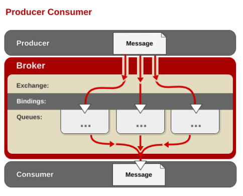

[TOC]

# 06.1 RabbitMQ入门

## 1. 为什么要使用MQ

消息（Message）是指在应用间传送的数据。消息可以非常简单，比如只包含文本字符串，也可以更复杂，可能包含嵌入对象。

消息队列（Message Queue）是一种应用间的通信方式，消息发送后可以立即返回，由消息系统来确保消息的可靠传递。消息发布者只管把消息发布到 MQ 中而不用管谁来取，消息使用者只管从 MQ 中取消息而不管是谁发布的。这样发布者和使用者都不用知道对方的存在。

从上面的描述中可以看出消息队列是一种应用间的异步协作机制，那什么时候需要使用 MQ 呢？

以常见的订单系统为例，用户点击【下单】按钮之后的业务逻辑可能包括：扣减库存、生成相应单据、发红包、发短信通知。在业务发展初期这些逻辑可能放在一起同步执行，随着业务的发展订单量增长，需要提升系统服务的性能，这时可以将一些不需要立即生效的操作拆分出来异步执行，比如发放红包、发短信通知等。这种场景下就可以用 MQ ，在下单的主流程（比如扣减库存、生成相应单据）完成之后发送一条消息到 MQ 让主流程快速完结，而由另外的单独线程拉取MQ的消息（或者由 MQ 推送消息），当发现 MQ 中有发红包或发短信之类的消息时，执行相应的业务逻辑。

MQ的优势：

-应用解耦：提高系统容错性和可维护性

-异步提速：提升用户体验和系统吞吐量

-削峰填谷：提高系统稳定性

MQ的劣势：

-系统可用性降低：系统引入的外部依赖越多，系统稳定性越差。一旦MQ宕机，就会对业务造成影响。如何保证MQ的高可用？集群

-系统复杂度提高：MQ的加入大大增加了系统的复杂度，以前系统间是同步的远程调用，现在是通过MQ进行异步调用。如何保证消息不被丢失情况？消息持久化，ACK确认机制，集群镜像，消息补偿机制等

## 2. JMS与AMQP

**JMS**（Java MessageService）实际上是指JMS API。JMS是由Sun公司早期提出的消息标准，旨在为java应用提供统一的消息操作。JMS已经成为JavaEE的一部分。从使用角度看，JMS和JDBC担任差不多的角色，用户都是根据相应的接口可以和实现了JMS的服务进行通信，进行相关的操作。

 **AMQP**（advanced message queuing protocol）在2003年时被提出，最早用于解决金融领不同平台之间的消息传递交互问题。顾名思义，AMQP是一种协议，更准确的说是一种binary wire-level protocol（链接协议）。这是其和JMS的本质差别，AMQP不从API层进行限定，而是直接定义网络交换的数据格式。这使得实现了AMQP的provider天然性就是跨平台的。从这一点看，AQMP可以用http来进行类比，不关心实现的语言，只要大家都按照相应的数据格式去发送报文请求，不同语言的client均可以和不同语言的server链接。

## 3. RabbitMQ简介

**RabbitMQ**是一个使用Erlang语言开发，建立在AMQP基础上的开源的消息中间件。（Erlang是编程语言中处理并发的佼佼者）

### 3.1 AMQP模型


工作过程：消息（message）被发布者（publisher）发送给交换机（exchange），交换机常常被比喻成邮局或者邮箱。然后交换机将收到的消息根据路由规则分发给绑定的队列（queue）。最后AMQP代理会将消息投递给订阅了此队列的消费者，或者消费者按照需求自行获取。

### 3.2 关键概念

1. **Broker**：又称消息代理，表示消息队列服务器实体，多个 RabbitMQ 服务器可以组成一个集群，形成一个逻辑 Broker。
2. **Virtual Host**：虚拟主机，表示一批交换器、消息队列和相关对象。每个 vhost 本质上就是一个 mini 版的 RabbitMQ 服务器，拥有自己的队列、交换器、绑定和权限机制。vhost 是 AMQP 概念的基础，必须在连接时指定，RabbitMQ 默认的 vhost 是 `/`。
3. **Exchange**：交换器，用来接收生产者发送的消息并将这些消息路由给服务器中的队列。
4. **Queue**：消息队列，用来保存消息直到发送给消费者。它是消息的容器，也是消息的终点。一个消息可投入一个或多个队列。消息一直在队列里面，等待消费者连接到这个队列将其取走。
5. **Binding**：绑定，用于消息队列和交换器之间的关联。一个绑定就是基于路由键将交换器和消息队列连接起来的路由规则，所以可以将交换器理解成一个由绑定构成的路由表。
6. **Message**：消息，消息是不具名的，它由消息头和消息体组成。消息体是不透明的，而消息头则由一系列的可选属性组成，这些属性包括routing-key（路由键）、priority（相对于其他消息的优先权）、delivery-mode（指出该消息可能需要持久性存储）等。
7. **Publisher**：消息的生产者，也是一个向交换器发布消息的客户端应用程序。
8. **Consumer**：消息的消费者，表示一个从消息队列中取得消息的客户端应用程序。

### 3.3 AMQP的消息路由

AMQP 中消息的路由过程和 Java 开发者熟悉的 JMS 存在一些差别，AMQP 中增加了 Exchange 和 Binding 的角色。生产者把消息发布到 Exchange 上，消息最终到达队列并被消费者接收，而 Binding 决定交换器的消息应该发送到那个队列。



### 3.4 Exchange类型

Exchange分发消息时根据类型的不同分发策略有区别，目前共四种类型：direct、fanout、topic、headers 。headers 匹配 AMQP 消息的 header 而不是路由键，此外 headers 交换器和 direct 交换器完全一致，但性能差很多，目前几乎用不到了，所以直接看另外三种类型：

1. direct

   

   消息中的路由键（routing key）如果和 Binding 中的 binding key 一致， 交换器就将消息发到对应的队列中。路由键与队列名完全匹配，如果一个队列绑定到交换机要求路由键为“dog”，则只转发 routing key 标记为“dog”的消息，不会转发“dog.puppy”，也不会转发“dog.guard”等等。它是完全匹配、单播的模式。

2. fanout

   

   每个发到 fanout 类型交换器的消息都会分到所有绑定的队列上去。fanout 交换器不处理路由键，只是简单的将队列绑定到交换器上，每个发送到交换器的消息都会被转发到与该交换器绑定的所有队列上。很像子网广播，每台子网内的主机都获得了一份复制的消息。fanout 类型转发消息是最快的。

3. topic

   

   topic 交换器通过模式匹配分配消息的路由键属性，将路由键和某个模式进行匹配，此时队列需要绑定到一个模式上。它将路由键和绑定键的字符串切分成单词，这些单词之间用点隔开。它同样也会识别两个通配符：符号“#”和符号“*”。""#""匹配0个或多个单词，"*"匹配不多不少一个单词。


## 4. 安装与部署

参考【00_分布式环境搭建指南】（8.RabbitMQ章节）

## 5. RabbitMQ WebUI操作

开启RabbitMQ服务，在浏览器地址栏输入：

```http
http://192.168.0.104:15672
```

使用guest作为用户名和密码登录。

### 5.1 创建Exchange

创建3个交换器：`b2c.direct`、`b2c.fanout`、`b2c.topic`


### 5.2 创建Queue

创建4个消息队列：`usa.news`、`usa.weather`、`europe.news`、`europe.weather`


### 5.3 Binding

按照以下规则进行交换器和消息队列的绑定：

| Exchange   | Queue     | Routing key       |
| ---------- | --------- | ----------------- |
| b2c.direct | 所有Queue | 为当前Queue的名称 |
| b2c.fanout | 所有Queue | 为当前Queue的名称 |
| b2c.topic  | 所有Queue | 为当前Queue的名称 |


### 5.4 消息发送测试

点击Exchange标签，再在交换器列表中点击任一交换器超级链接即可发送消息。

测试direct：点击b2c.direct交换器发送消息，路由键设置为usa.news


在队列界面我们应该可以看到只有usa.news这个队列接收到了消息。


点击usa.news超级链接即可进去查看消息。


Ack Mode选择：

- Nack模式，表示该消息查看以后不会被消费（消息不会从queue中移除），下次点击查看仍是这一条消息。

- Ack模式，表示该消息查看以后会被消费掉（消息会从queue中移除），下次点击查看的是下一条消息。

测试fanout：点击b2c.fanout，路由键任意填写或者不填写，发送消息以后，只要和这个交换器绑定的队列都应能收到消息。

测试topic：点击b2c.topic，路由键填写为usa.#，发送消息后，usa.news和usa.weather可以收到消息，另外两个队列收不到消息。

 